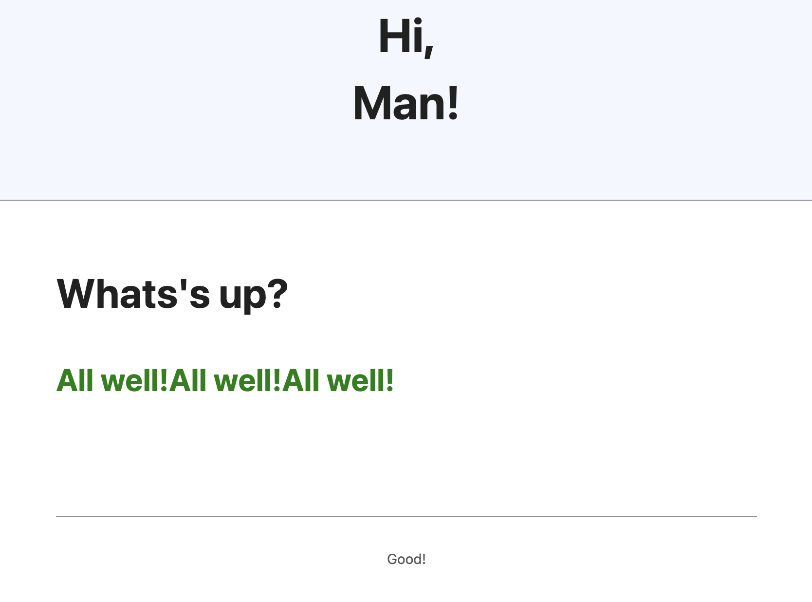

# express-json-html
## A JSON template engine for express

```
npm install
npm start

http://localhost:3000/
```

### index.json

```json
{
  "html": {
    "head": {
      "title":"Hi!",
      "link": {
        "attr": {"rel": "stylesheet","href": "https://cdn.simplecss.org/simple.min.css"}
      }
    },
    "body": {
      "header": [
        {"h1": "Hi,"},
        {"h1": "{title}"}
      ],
      "main": {
        "h2": "Whats's up?",
        "h3": {
          "attr": {"style": "color:green"},
          "span": {
            "loop": 3,
            "span": "All well!"
          }
        }
      },
      "footer": {
        "attr": {"id": "footer"},
        "div": {
          "div": {
            "div": {
              "attr": {"id": "inner_div"},
              "span": "Good!"
            }
          }
        }
      }
    }
  }
}
```

### Output

